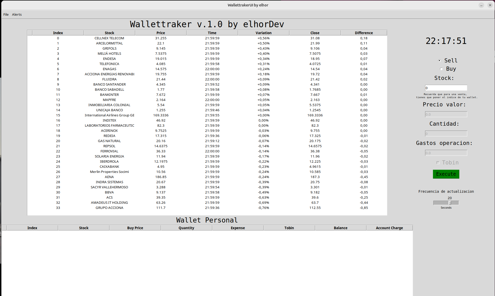
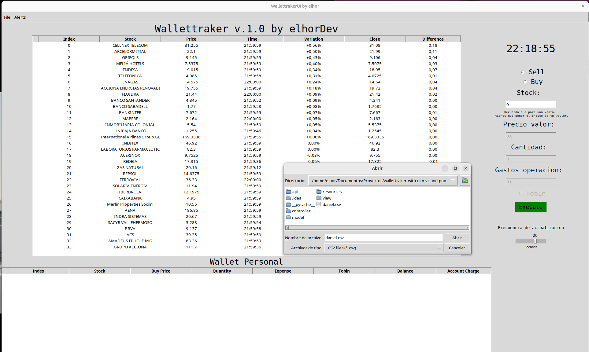

# Wallet Tracker con UI, MVC y POO

Proyecto personal para la gestión de transacciones de compra y venta de acciones en el IBEX 35, con una interfaz gráfica de usuario (UI), implementado siguiendo el patrón de diseño Modelo-Vista-Controlador (MVC) y utilizando principios de Programación Orientada a Objetos (POO). Este proyecto está destinado a la práctica y aprendizaje, sin intención de lucro.

## Descripción

Wallet Tracker es una aplicación que permite a los usuarios realizar un seguimiento de sus transacciones en el mercado de acciones. La aplicación presenta una interfaz gráfica intuitiva que facilita la gestión de las operaciones bursátiles. Este proyecto es una mejora de versiones anteriores, incorporando el patrón MVC para una mejor organización del código y la modularidad.

## Características

- **Interfaz Gráfica de Usuario (UI)**: Interfaz amigable y fácil de usar.
- **Patrón MVC**: Separación clara de las responsabilidades del modelo, la vista y el controlador.
- **POO**: Implementación utilizando principios de Programación Orientada a Objetos.
- **Sistema de Alertas**: Notificaciones para eventos importantes en tu cartera.
- **Importación/Exportación CSV**: Posibilidad de exportar e importar tu cartera en formato CSV.

## Instalación

1. Clona el repositorio:
    ```bash
    git clone https://github.com/elhordev/wallettraker-with-ui-mvc-and-poo.git
    ```
2. Navega al directorio del proyecto:
    ```bash
    cd wallettraker-with-ui-mvc-and-poo
    ```
3. Instala las dependencias necesarias:
    ```bash
    pip install requests pandas tkinter beautifulsoup4 time csv-manager
    ```

## Uso

1. Ejecuta la aplicación:
    ```bash
    python main.py
    ```
2. Utiliza la interfaz para agregar, editar y eliminar registros de compra y venta de acciones.

## Estructura del Proyecto

- `main.py`: Archivo principal para ejecutar la aplicación.
- `models/`: Contiene las clases que representan los datos y la lógica de negocio.
- `views/`: Contiene las clases relacionadas con la interfaz gráfica de usuario.
- `controllers/`: Contiene las clases que gestionan la comunicación entre el modelo y la vista.
- `resources/`: Contiene recursos adicionales como archivos de configuración o datos.

## Contribuciones

Las contribuciones son bienvenidas. Por favor, abre un issue para discutir cualquier cambio importante antes de enviar un pull request.


## Contacto

Autor: elhordev


